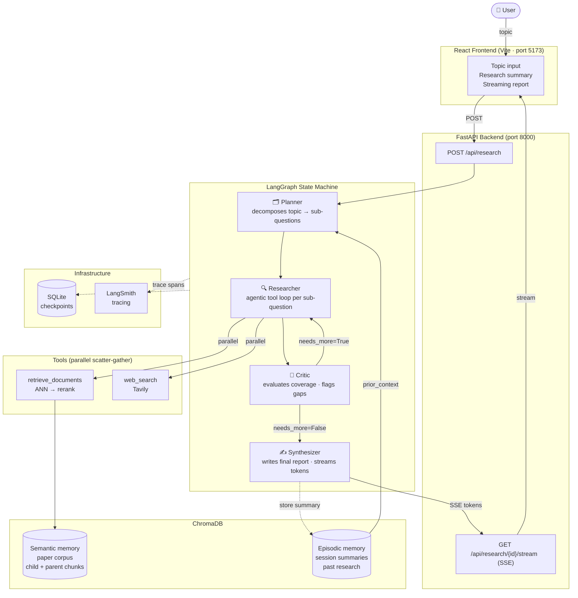

# AI Research Agent

A multi-agent research assistant that demonstrates end-to-end AI agent engineering:
hierarchical RAG retrieval, cross-encoder reranking, LangGraph state-machine orchestration,
streaming synthesis, and external vector memory — designed with patterns borrowed from
high-performance computing.

---

## Architecture



---

## HPC-Influenced Design Decisions

This system was designed by someone with a background in distributed systems and HPC.
The patterns map directly:

### 1. Batch embedding (≡ MPI collective operations)

`embed_batch()` calls `SentenceTransformer.encode(all_texts)` once for an entire document's
worth of child chunks instead of encoding each chunk individually. A transformer encoder has
fixed per-call overhead — kernel launch, memory transfer, attention mask setup — regardless
of batch size. Encoding N=1000 chunks individually pays that overhead 1000 times; encoding
them together pays it once. Same reasoning as using `MPI_Allreduce` over a single
`MPI_Send`/`MPI_Recv` pair per process — the per-call cost is amortized across the payload.

### 2. Parallel tool execution (≡ scatter-gather)

When the researcher node calls multiple tools in one LLM turn, `execute_tools_parallel()`
runs them concurrently with `asyncio.gather`. Wall-clock latency is `max(tool_times)`
instead of `sum(tool_times)`. Similarly, `researcher_node` fans out all sub-questions in
parallel — four sub-questions each taking 5 seconds completes in 5 seconds, not 20.
This is structurally identical to a non-blocking MPI scatter followed by `MPI_Waitall`.

### 3. Hierarchical chunking (≡ cache hierarchy)

Child chunks (256 tokens) are used as retrieval keys — small, precise, fast to search.
Parent chunks (512 tokens) are returned to the model — larger, richer context.
The lookup unit and the return unit are different sizes, exactly like an L1 cache line
(64 bytes) triggering an L2 line fetch (512 bytes) on a miss.

### 4. Checkpointing (≡ checkpoint/restart)

LangGraph's `SqliteSaver` writes the full `AgentState` to SQLite after every node completes.
If the process crashes mid-pipeline, the next invocation with the same `thread_id` resumes
from the last checkpoint rather than restarting from scratch. This is the same guarantee
provided by BLCR or DMTCP for HPC jobs: you pay the checkpoint cost at each stage boundary
so a failure never costs you more than one stage of work.

### 5. Two-stage retrieve-then-rerank (≡ coarse + fine search)

The bi-encoder (bge-large-en-v1.5) retrieves top-20 candidates in O(log N) via HNSW —
fast, approximate, high recall. The cross-encoder (Cohere rerank-english-v3.0) re-scores
only those 20 candidates — slow, exact, high precision. This mirrors the coarse-then-fine
search pattern in scientific computing: fast FFT-based correlation to find candidate regions,
expensive numerical integration only on the candidates.

---

## Quick Start — Local Development

### Prerequisites

- Python 3.11+, [uv](https://docs.astral.sh/uv/)
- Node.js 18+ (frontend)
- API keys: Anthropic, Cohere, Tavily

### Backend

```bash
git clone <repo-url> && cd ai-research-agent

# Install Python deps
uv sync

# Configure environment
cp .env.template .env
# Edit .env: fill in ANTHROPIC_API_KEY, COHERE_API_KEY, TAVILY_API_KEY

# Seed the vector index (downloads papers + embedding model on first run)
uv run python -m src.ingestion.pipeline

# Start the API server
uv run uvicorn src.api.main:app --port 8000 --reload
```

### Frontend

```bash
cd frontend
npm install
npm run dev          # http://localhost:5173
```

---

## Quick Start — Docker

```bash
# 1. Build and start backend + chromadb
docker compose up --build

# 2. Seed the vector index (run once)
docker compose run --rm --profile tools ingest

# Frontend still runs locally (Vite proxies /api → localhost:8000)
cd frontend && npm run dev
```

---

## Project Structure

```
ai-research-agent/
├── src/
│   ├── config.py              # Typed settings (pydantic-settings)
│   ├── tracing.py             # LangSmith setup + wrap_anthropic
│   ├── ingestion/
│   │   ├── fetcher.py         # Async parallel HTML fetching (httpx + asyncio.gather)
│   │   ├── chunker.py         # Hierarchical chunking (tiktoken, parent/child)
│   │   ├── embedder.py        # Batch embedding (bge-large-en-v1.5)
│   │   ├── store.py           # ChromaDB client (PersistentClient or HttpClient)
│   │   └── pipeline.py        # Orchestrates fetch → chunk → embed → store
│   ├── tools/
│   │   ├── retrieval.py       # ANN search → Cohere rerank (@traceable)
│   │   ├── web_search.py      # Tavily web search (@traceable)
│   │   └── executor.py        # Parallel tool dispatcher (asyncio.to_thread)
│   ├── graph/
│   │   ├── state.py           # AgentState TypedDict + operator.add reducers
│   │   ├── nodes.py           # planner / researcher / critic / synthesizer
│   │   ├── builder.py         # StateGraph wiring, interrupt, checkpointer factory
│   │   └── run.py             # CLI driver with human-in-the-loop review
│   ├── memory/
│   │   └── session_memory.py  # Episodic memory: store + retrieve + summarize
│   └── api/
│       ├── main.py            # FastAPI app + lifespan (graph init, CORS)
│       ├── routes.py          # POST /api/research, GET /api/research/{id}/stream
│       └── models.py          # Pydantic request/response schemas
├── frontend/
│   └── src/
│       └── App.jsx            # Single-page app: form → summary → SSE stream
├── Dockerfile                 # Layer-ordered for fast rebuilds; pre-bakes model weights
├── docker-compose.yml         # backend + chromadb services; ingest one-shot job
├── pyproject.toml             # All deps with explanatory comments
└── .env.template              # Required: ANTHROPIC_API_KEY, COHERE_API_KEY, TAVILY_API_KEY
```

---

## API Reference

| Method | Path | Description |
|--------|------|-------------|
| `GET`  | `/health` | Liveness check |
| `POST` | `/api/research` | Start research session (runs to interrupt) |
| `GET`  | `/api/research/{id}/stream` | SSE stream — resumes graph, streams synthesis tokens |
| `GET`  | `/api/research/{id}/state` | Session status poll |

### POST /api/research

```json
// Request
{ "topic": "How does retrieval-augmented generation work?", "max_iterations": 2 }

// Response
{
  "session_id": "uuid",
  "topic": "...",
  "sub_questions": ["...", "..."],
  "research_results": [{"question": "...", "answer": "..."}],
  "critique": "...",
  "gaps": ["..."],
  "iteration": 1,
  "ready_for_synthesis": true
}
```

### GET /api/research/{id}/stream  (SSE)

```
data: {"type": "token",  "content": "Retrieval"}
data: {"type": "token",  "content": "-Augmented"}
...
data: {"type": "done",   "session_id": "uuid"}
```

---

## Environment Variables

| Variable | Required | Default | Description |
|----------|----------|---------|-------------|
| `ANTHROPIC_API_KEY` | **yes** | — | Claude API key |
| `COHERE_API_KEY` | **yes** | — | Cohere reranking key |
| `TAVILY_API_KEY` | **yes** | — | Tavily web search key |
| `LANGSMITH_API_KEY` | no | `""` | LangSmith tracing (optional) |
| `CHROMA_USE_HTTP` | no | `false` | `true` for Docker / remote ChromaDB |
| `LLM_MODEL` | no | `claude-sonnet-4-6` | Anthropic model ID |
| `RETRIEVAL_TOP_K` | no | `20` | ANN candidates before reranking |
| `RERANK_TOP_N` | no | `5` | Results returned after reranking |
| `MAX_RESEARCH_ITERATIONS` | no | `2` | Max critic→researcher loops |
